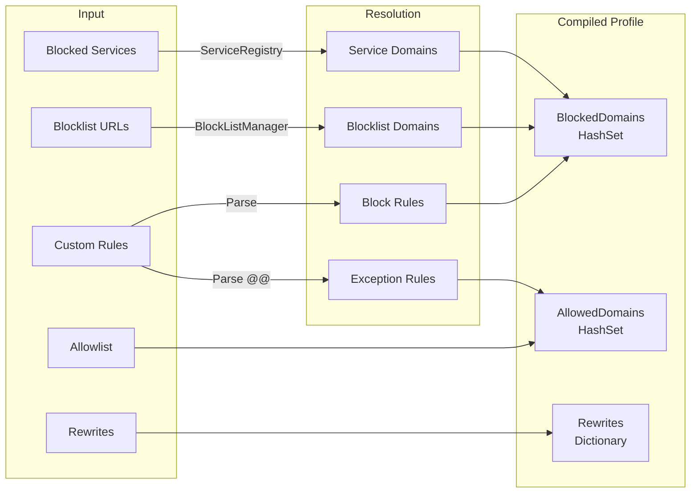

# Profile Compilation

Profile compilation transforms the declarative configuration (service names, blocklist URLs, domain lists) into optimized runtime data structures for fast DNS query evaluation.

## Compilation Process



## Service Expansion

When a profile includes `blockedServices: ["youtube"]`, the `ServiceRegistry` resolves `youtube` to its domain list:

```
youtube.com
www.youtube.com
m.youtube.com
youtubei.googleapis.com
youtube-nocookie.com
...
```

All service domains are added to `BlockedDomains`.

## Blocklist Resolution

Blocklist URLs reference global entries in `config.blockLists`. The `BlockListManager` maintains a local cache of downloaded lists. During compilation:

1. For each URL in the profile's `blockLists`, look up the cached domain set
2. Add all domains to `BlockedDomains`
3. Skip disabled blocklists

## Custom Rule Parsing

Custom rules are split into block and allow rules:

- Lines starting with `@@` have the prefix stripped and are added to `AllowedDomains`
- Lines starting with `#` are comments (ignored)
- All other non-empty lines are added to `BlockedDomains`

## Base Profile Merging

When a base profile is configured and the profile being compiled is not the base itself:

1. Compile the base profile first
2. Merge `BlockedDomains`: union of base + profile
3. Merge `AllowedDomains`: union of base + profile
4. Merge `Rewrites`: union, with the child profile's entries winning on conflict

This happens at compile time, not at query time. The resulting compiled profile contains all inherited data.

## Recompilation Triggers

Profiles are recompiled when:

- Configuration is reloaded (any change via web UI)
- Blocklists are refreshed (background timer or manual refresh)

Recompilation produces a new `Dictionary<string, CompiledProfile>` that is swapped in atomically via a volatile reference. In-flight queries continue using the old compiled data until they complete.
