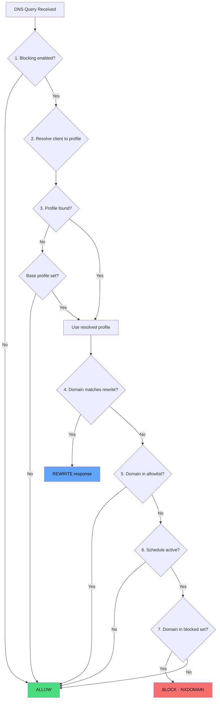

# Filtering Pipeline

The filtering pipeline is the core evaluation logic that determines whether a DNS query should be allowed, blocked, or rewritten. It runs on every DNS query processed by the plugin.

## Evaluation Order

### Step 1: Global Kill Switch

If `enableBlocking` is `false`, all queries are immediately allowed. This is the dashboard protection toggle.

### Step 2: Client Resolution

The plugin extracts the source IP and optional TLS client ID from the DNS request metadata. It walks the client list looking for a matching identifier:

- Exact IP match
- CIDR range containment
- MAC address match (if available from Technitium)
- DNS-over-TLS/HTTPS client ID match (extracted from SNI)

### Step 3: Profile Lookup

If the client has an assigned profile, use it. Otherwise, fall back to the default profile, then the base profile. If none are configured, the query is allowed.

### Step 4: DNS Rewrites

Check the profile's compiled rewrites (including merged base profile rewrites). If the query domain matches a rewrite, the plugin stores the rewrite config and tells Technitium the query is "allowed" -- but then intercepts the response in `ProcessRequestAsync` to inject the rewrite answer.

Rewrites take absolute precedence. A rewritten domain is never evaluated against blocklists.

### Step 5: Allowlist Check

Check the profile's compiled allowed domains (including merged base profile allowed domains and `@@`-prefixed custom rules). If matched, the query is allowed unconditionally.

This is the mechanism for overriding base profile blocks in child profiles.

### Step 6: Schedule Check

If the profile has a schedule, check whether the current time (in the configured timezone) falls within an active window. If the schedule is inactive, the query is allowed.

### Step 7: Block Check

Check the profile's compiled blocked domains. This set is the union of:

- Domains from subscribed blocklists
- Domains from blocked services
- Custom block rules (non-`@@`, non-comment lines)
- Base profile's blocked domains (if applicable)

If matched, the query is blocked and Technitium returns NXDOMAIN.

### Step 8: Default Allow

If no rule matched, the query is allowed and forwarded upstream normally.

## Domain Matching

All domain checks use subdomain-walking: a lookup for `sub.example.com` checks `sub.example.com`, then `example.com`, then `com`. This means adding `example.com` to any domain set (blocked, allowed, or rewrite) automatically covers all subdomains.

Matching is case-insensitive and ignores trailing dots.

## Compiled Profile Structure

At runtime, profiles are compiled into optimized data structures:

| Field | Type | Source |
|-------|------|--------|
| `BlockedDomains` | `HashSet<string>` | Blocklists + services + custom block rules + base profile |
| `AllowedDomains` | `HashSet<string>` | Allowlist + `@@` custom rules + base profile |
| `Rewrites` | `Dictionary<string, DnsRewriteConfig>` | Profile rewrites + base profile rewrites |

HashSet lookups are O(1), making the filtering pipeline fast regardless of the number of blocked domains.
