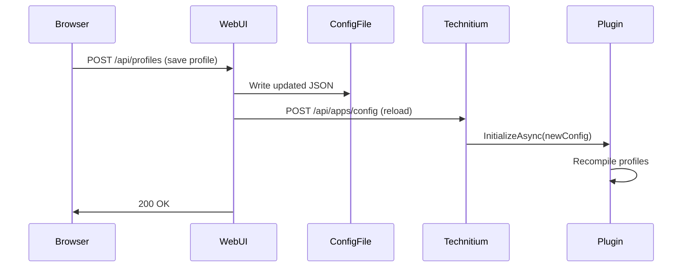
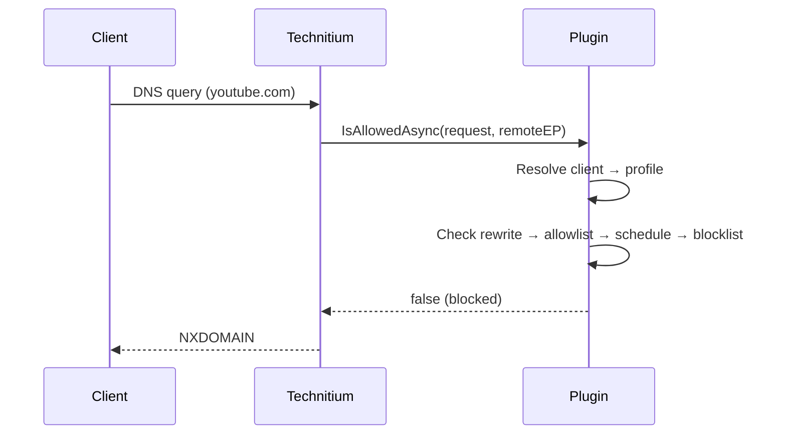

# Architecture Overview

The system has two main components: a C# DNS app plugin that runs inside Technitium DNS Server, and a Python web application for management.

## Component Diagram

```mermaid
graph TB
    subgraph Technitium DNS Server
        DNS[DNS Listener<br/>UDP/TCP 53, DoT 853]
        APP[Content Filter Plugin]
        DNS --> APP
    end

    subgraph Web UI
        WEB[Starlette App]
        JS[Browser JS]
        JS --> |HTTP API| WEB
    end

    CLIENTS[DNS Clients] --> |DNS Queries| DNS
    WEB --> |Read/Write| CONFIG[(config.json)]
    APP --> |Read| CONFIG
    WEB --> |Reload API| Technitium DNS Server
    APP --> |Download| LISTS[Remote Blocklists]

    style CONFIG fill:#f9f,stroke:#333
```

## C# Plugin

The plugin implements Technitium's `IDnsApplication` and `IDnsRequestBlockingHandler` interfaces:

- **`App`** -- Entry point. Manages initialization, config reloading, blocklist refresh, and DNS response construction for rewrites.
- **`ConfigService`** -- Loads and saves the JSON configuration. Handles backward-compatible deserialization.
- **`ProfileCompiler`** -- Transforms profile configurations into compiled domain sets (HashSets) for fast lookup. Handles service expansion, blocklist resolution, base profile merging, and rewrite compilation.
- **`FilteringService`** -- Evaluates DNS queries against compiled profiles. Implements the 8-step filtering pipeline.
- **`DomainMatcher`** -- Subdomain-walking domain lookup. Checks `example.com`, then `com`, walking up the domain hierarchy.
- **`BlockListManager`** -- Downloads, caches, and parses remote blocklists. Supports hosts, plain domain, and AdGuard formats.
- **`ServiceRegistry`** -- Loads built-in service definitions from embedded JSON. Exports them to the app folder for the web UI.

## Python Web UI

The web UI is a Starlette application with Mako templates and vanilla JavaScript:

- **`app.py`** -- All routes (pages and API endpoints), configuration I/O, and Technitium reload integration.
- **Templates** -- Server-rendered HTML with Tailwind CSS styling.
- **JavaScript** -- Client-side interactivity: modal dialogs, inline CRUD, profile pickers, and SPA-style updates.

## Data Flow

### Config Changes



### DNS Query



## Concurrency Model

- **Compiled profiles** are swapped atomically via a volatile reference. No locks on the read path.
- **Pending rewrites** use a `ConcurrentDictionary<ushort, DnsRewriteConfig>` keyed by DNS message ID to pass rewrite data from `IsAllowedAsync` to `ProcessRequestAsync`.
- **Blocklist refresh** runs on a background timer every 15 minutes. Individual lists track their own staleness via `refreshHours`.
- **Config writes** from the web UI are serialized (single-threaded Starlette handler), so there are no concurrent write conflicts.
