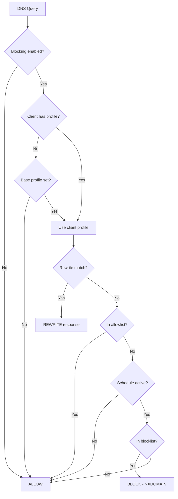

# Technitium Content Filter

A content filtering DNS app plugin for [Technitium DNS Server](https://technitium.com/dns/). Provides domain blocking, allowlisting, DNS rewrites, service-level filtering, and per-client profile assignment -- all managed through a web UI.

## Features

- **Per-profile filtering** -- Create profiles with independent blocklists, allowlists, custom rules, and DNS rewrites. Assign profiles to clients by IP, CIDR, MAC address, or DNS-over-TLS client ID.
- **Blocklist subscriptions** -- Subscribe to remote blocklists (AdGuard, hosts, plain domain formats). Automatic refresh on a configurable schedule.
- **Blocked services** -- Block entire services (YouTube, TikTok, etc.) with built-in domain lists. Define custom services with your own domain sets.
- **DNS rewrites** -- Redirect domains to alternate IPs or hostnames (e.g., force SafeSearch via CNAME rewrite).
- **Base profile inheritance** -- Designate a base profile whose filters merge into all other profiles. Profile-level allowlists override base-level blocks.
- **Time-based schedules** -- Enable/disable filtering per day-of-week with timezone support.
- **Web management UI** -- Dashboard with protection toggle, profile/client management, and a full Filters menu.

## Quick Start

```bash
# Build the plugin
docker build -f Dockerfile.build -o dist .

# Install to Technitium
curl -s -X POST "https://your-dns-server/api/apps/install" \
  -F "token=YOUR_API_TOKEN" \
  -F "name=ContentFilter" \
  -F "appZip=@dist/ContentFilter.zip"
```

See [Installation](getting-started/installation.md) for detailed setup instructions.

## How It Works

When a DNS query arrives, the plugin evaluates it through a filtering pipeline:



See [Filtering Pipeline](architecture/filtering.md) for the full evaluation order.

## Project Components

| Component | Technology | Description |
|-----------|-----------|-------------|
| DNS Plugin | C# / .NET 9 | Technitium app that intercepts and filters DNS queries |
| Web UI | Python / Starlette | Management interface for profiles, clients, and filters |
| Frontend | Vanilla JS / Tailwind CSS | Browser-side interactivity for the web UI |
